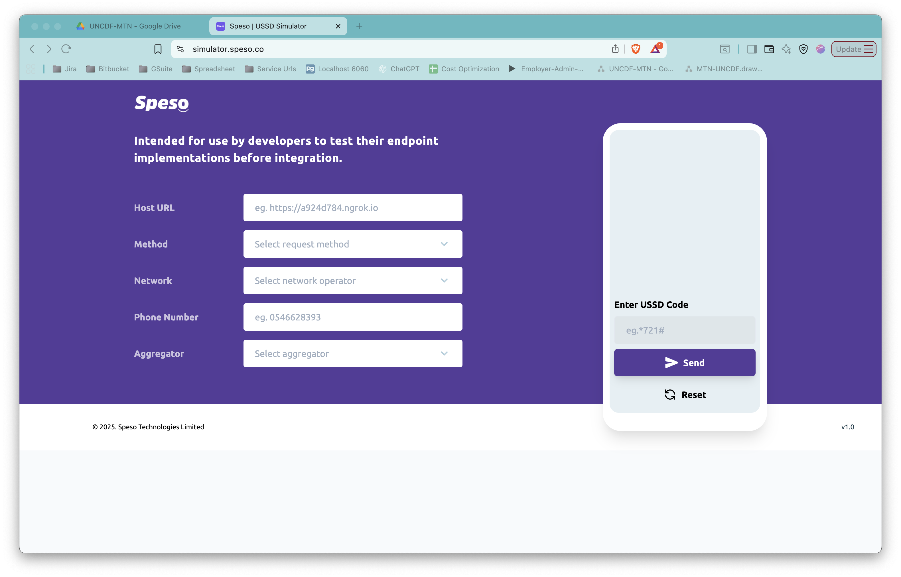

# USSD Simulator

A Next.js-based USSD simulator designed to test USSD endpoint implementations before integration. Built with TypeScript, Tailwind CSS, and featuring a beautiful purple gradient design inspired by Speso.



## Features

- **Configurable Backend URL**: Test against any USSD endpoint
- **Multiple Network Support**: MTN, Vodafone, AirtelTigo
- **Multi-Session Management**: Test multiple concurrent USSD sessions
- **Interactive Phone Simulator**: Realistic mobile phone interface
- **Request/Response Logger**: Debug panel with detailed logging
- **Copy to Clipboard**: Easy copying of request/response payloads
- **Real-time Updates**: Instant feedback on USSD interactions

## Tech Stack

- **Next.js 14** - React framework with App Router
- **TypeScript** - Type-safe development
- **Tailwind CSS** - Utility-first styling
- **Axios** - HTTP client for API calls
- **UUID** - Session ID generation

## Getting Started

### Prerequisites

- Node.js 18+ installed
- npm or yarn package manager

### Installation

1. Clone the repository:
```bash
git clone <repository-url>
cd ussd-simulator
```

2. Install dependencies:
```bash
npm install
```

3. Start the development server:
```bash
npm run dev
```

4. Open [http://localhost:3000](http://localhost:3000) in your browser

## Usage

### Testing the MTN-UNCDF USSD Application

1. **Start the Backend**:
   - Navigate to the MTN-UNCDF project directory
   - Run: `mvn spring-boot:run`
   - Backend will be available at `http://localhost:8080/api/v1/loans/ussd`

2. **Configure the Simulator**:
   - **Host URL**: Enter your backend URL (default: `http://localhost:8080/api/v1/loans/ussd`)
   - **Network**: Select your network operator (MTN, Vodafone, AirtelTigo)
   - **Phone Number**: Enter a test phone number (e.g., `0546628393`)

3. **Start a USSD Session**:
   - Click "+ New" to create a new session
   - In the phone simulator, enter a USSD code (e.g., `*721#`)
   - Click "Send" to initiate the session

4. **Navigate the USSD Flow**:
   - Follow the on-screen prompts
   - Enter your responses in the input field
   - View real-time responses in the phone display

5. **Debug with Logger**:
   - Expand the Request/Response Logger panel at the bottom
   - Click on any log entry to view full request/response details
   - Use "Copy" buttons to copy JSON payloads

6. **Manage Multiple Sessions**:
   - Create multiple sessions for concurrent testing
   - Switch between sessions using the session selector
   - Each session maintains its own conversation history

### USSD Flow Example (MTN-UNCDF Registration)

```
1. Enter: *721#
   → Response: Welcome to MTN-UNCDF Financial Product
   
2. Enter: 1 (for registration)
   → Response: Enter an alphanumeric 4-8 digit pin
   
3. Enter: pin1234
   → Response: Repeat the 4-8 digit pin
   
4. Enter: pin1234
   → Response: Accept Terms & Conditions (Menu)
   
5. Enter: 1 (Accept)
   → Response: Enter your PIN to accept T&Cs
   
6. Enter: pin1234
   → Response: Success! Registration completed
```

## API Contract

### Request Format

```json
{
  "USSDReq": {
    "msisdn": "0546628393",
    "msg": "user_input",
    "network": "MTN",
    "UserSessionId": "uuid-v4"
  }
}
```

### Response Types

**Menu Response**:
```json
{
  "USSDResp": {
    "action": "menu",
    "menus": ["1. Option 1", "2. Option 2"],
    "title": "Select an option",
    "key": "powered by..."
  }
}
```

**Prompt Response**:
```json
{
  "USSDResp": {
    "action": "prompt",
    "menus": "Enter your PIN",
    "title": "PIN Setup",
    "key": "powered by..."
  }
}
```

**End Response**:
```json
{
  "USSDResp": {
    "action": "end",
    "menus": "Success! Registration completed",
    "title": "Registration",
    "key": "powered by..."
  }
}
```

## Project Structure

```
ussd-simulator/
├── app/
│   ├── page.tsx              # Main simulator page
│   ├── layout.tsx            # Root layout
│   └── globals.css           # Global styles
├── components/
│   ├── ConfigPanel.tsx       # Configuration form
│   ├── PhoneSimulator.tsx    # Phone UI component
│   ├── UssdScreen.tsx        # USSD display screen
│   ├── RequestResponseLogger.tsx  # Debug logger
│   └── SessionManager.tsx    # Session management UI
├── lib/
│   ├── types.ts              # TypeScript interfaces
│   ├── ussdApi.ts            # API client
│   └── sessionStore.ts       # Session state management
└── public/                   # Static assets
```

## Development

### Build for Production

```bash
npm run build
npm run start
```

### Linting

```bash
npm run lint
```

## Features in Detail

### Configuration Panel
- **Host URL**: Configure the backend endpoint
- **Method**: HTTP method (fixed to POST)
- **Network**: Select network operator
- **Phone Number**: Test phone number
- **Session Selector**: Switch between active sessions

### Phone Simulator
- Realistic mobile phone interface
- USSD code input field
- Send and Reset buttons
- Loading states
- Response display area

### Request/Response Logger
- Collapsible debug panel
- Request/response JSON display
- Timestamp tracking
- Success/error indicators
- Duration metrics
- Copy to clipboard functionality

### Session Management
- Multiple concurrent sessions
- Independent conversation history
- Session switching
- Reset functionality
- Delete sessions

## Troubleshooting

### Connection Errors

**Problem**: "No response from server"
- Ensure the backend is running
- Check the Host URL is correct
- Verify CORS is enabled on the backend

### Invalid Response Format

**Problem**: Response doesn't display correctly
- Check response matches the API contract
- Verify `action` field is one of: `menu`, `prompt`, `end`
- Ensure `menus` field type matches action type

## Contributing

1. Fork the repository
2. Create a feature branch
3. Make your changes
4. Test thoroughly
5. Submit a pull request

## License

© 2025 Speso Technologies Limited

## Support

For issues and questions, please contact Speso Technologies Limited.

---

**Intended for use by developers to test their endpoint implementations before integration.**
